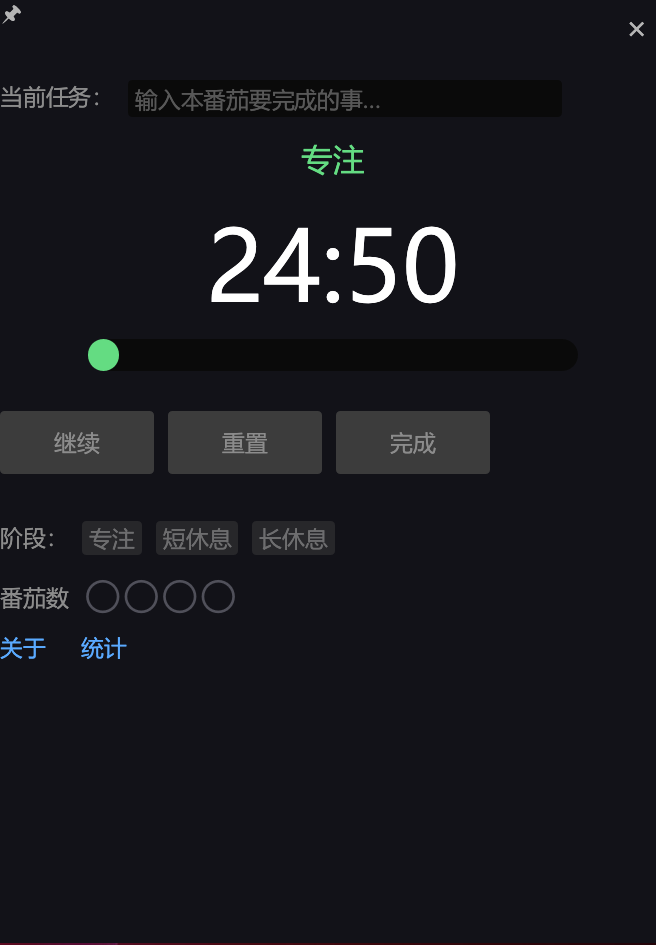
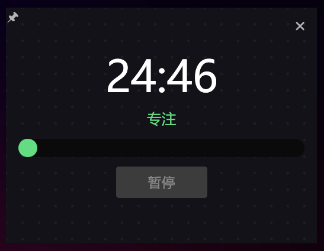

# Red Tomato — 番茄工作法桌面应用

使用 **Rust + egui** 实现的番茄钟桌面应用






## 番茄工作法步骤

1. 选择要做的任务。
2. 设置番茄钟（传统为 25 分钟）。
3. 专注工作。
4. 铃响后结束，在纸上打一个勾。
5. 若不足 4 个勾，休息 5 分钟，然后回到步骤 2。
6. 完成 4 个番茄后，休息 15 分钟，勾数清零，回到步骤 1。

## 功能

- **专注 / 短休息 / 长休息** 三阶段，默认 25 / 5 / 15 分钟。
- **开始、暂停、继续、停止** 计时控制。
- **本轮回番茄数** 显示（✓✓✓○），4 个后自动进入长休息并清零。
- **完整模式 / 紧凑模式** 切换界面。

## 运行

```bash
cargo run
```

## 依赖

- [eframe](https://github.com/emilk/egui) + [egui](https://docs.rs/egui) — 跨平台 GUI
- [chrono](https://docs.rs/chrono) — 时间与计时

## 许可证

MIT
